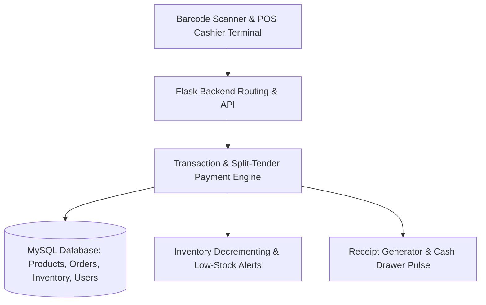
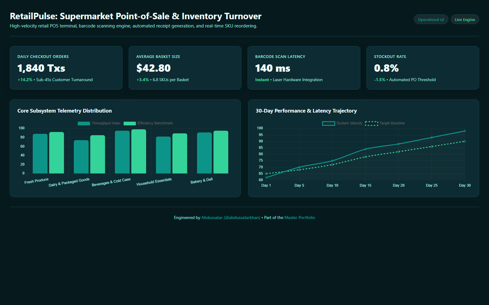

# Smart Retail POS — Full-Stack Supermarket & Store Checkout System

<div align="center">

[](https://github.com/abdussatarkhan)
[](https://github.com/abdussatarkhan)
[](https://github.com/abdussatarkhan)

</div>

[](https://github.com/abdussatarkhan/point-of-sale-/actions)
[](https://flask.palletsprojects.com/)
[](https://www.python.org/)
[](https://www.mysql.com/)
[](https://developer.mozilla.org/)

> **A full-stack retail checkout and store inventory management system powered by Python Flask and MySQL. Supports instant USB barcode scanning, split-tender payments (Cash, Card, Credit), discount engines, receipt generation, and real-time inventory deductions.**

---

## 🏛️ System Architecture



---

## 🌟 Key Features & Capabilities

- **🛒 High-Speed Barcode Checkout**: Automated barcode scanner listener designed for rapid supermarket cashier workflows with instant product resolution and quantity incrementing.
- **💳 Split-Tender Payment Engine**: Supports flexible customer checkout across multiple payment methods in a single order (Cash, Debit/Credit Card, Store Credit).
- **📦 Real-Time Inventory Control**: Automated stock level decrements on completed transactions with low-inventory warnings displayed on cashier screens.
- **🧾 Shift Balancing & Auditing**: End-of-shift cashier balance reports reconciling cash drawer collections against computerized order logs.

---

## 🚀 Quickstart & Setup

### Prerequisites
- [Python 3.10+](https://www.python.org/downloads/)
- [MySQL 8.0+](https://www.mysql.com/downloads/)

### 1. Clone the Repository
```bash
git clone https://github.com/abdussatarkhan/point-of-sale-.git
cd point-of-sale-
```

### 2. Environment Setup & Database Configuration
```bash
# Create and activate virtual environment
python -m venv venv
source venv/bin/activate  # On Windows: .\venv\Scripts\activate

# Install dependencies
pip install -r requirements.txt

# Configure database credentials in config.py or create a .env file:
# DB_HOST=localhost
# DB_USER=root
# DB_PASSWORD=your_password
# DB_NAME=pos_db

# Run database migration (if needed)
# mysql -u root -p pos_db < migrate_v2.sql

# Start the POS server
python app.py
```

Access the POS cashier portal at:
`http://localhost:5000`

---

## 🖥️ Application & Operational Interface

<p align="center">
  
</p>

> [!TIP]
> You can also explore [`dashboard.html`](dashboard.html) directly in any modern browser for a standalone interface walkthrough.

---

## 🗺️ Roadmap & Upcoming Enhancements

- [x] Flask + MySQL cashier and split-tender payment engine
- [x] Barcode scanner integration and inventory tracking
- [x] Receipt generation and shift closing summaries
- [ ] USB ESC/POS thermal receipt printer raw socket driver
- [ ] Offline browser cart caching with IndexedDB
- [ ] Multi-store stock transfer and replenishment requests

---

## 👨‍💻 Author & Contact

Built and maintained by **Abdussatar** ([@abdussatarkhan](https://github.com/abdussatarkhan)).  
For technical discussions, collaboration, or queries, feel free to reach out via [LinkedIn](https://www.linkedin.com/in/abdus-satar-5150813b5/) or [GitHub](https://github.com/abdussatarkhan).

---

## 📜 License

This project is licensed under the **MIT License** — see the [LICENSE](LICENSE) file for details.

---

<div align="center">

### 👨‍💻 Maintained by [Abdussatar (@abdussatarkhan)](https://github.com/abdussatarkhan)
Part of the **[Abdussatar Software Engineering & Systems Portfolio](https://github.com/abdussatarkhan)**.

⭐ If you find this project valuable, consider dropping a star! ⭐

</div>
